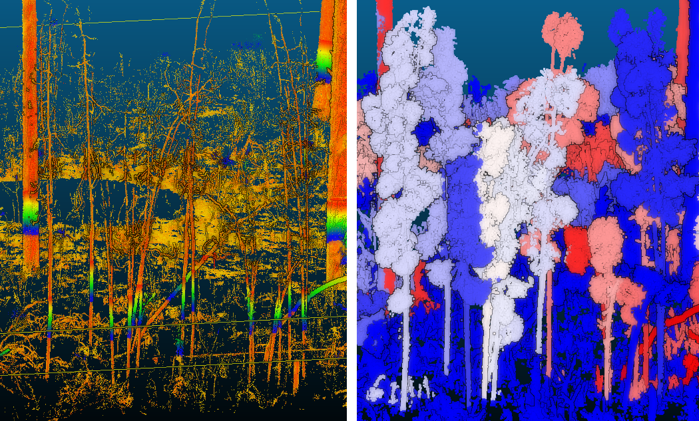

# Jones Center at Ichauway Landscape Ecology Lab

Repository for protocols for my lab

</img>

* [Protocol for processing TLS ](TLS_protocol/TLS_protocol.md)
  * Collecting scans [forthcoming]
  * Stitching scans [forthcoming]
  * Merge and tile TLS scans
  * Denoise and repair registration errors
  * Stem map using `spanner`

